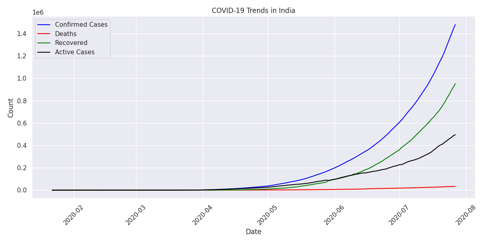
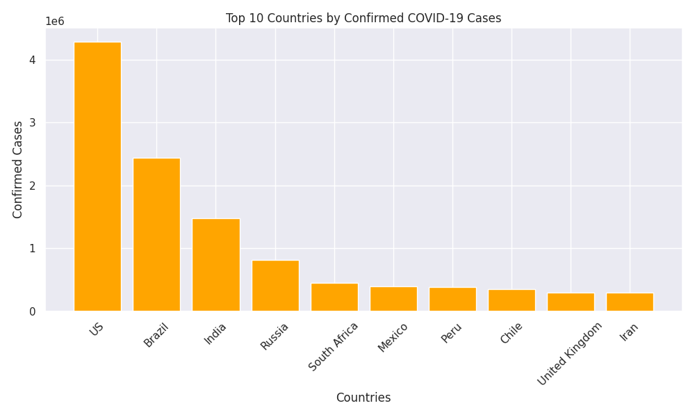
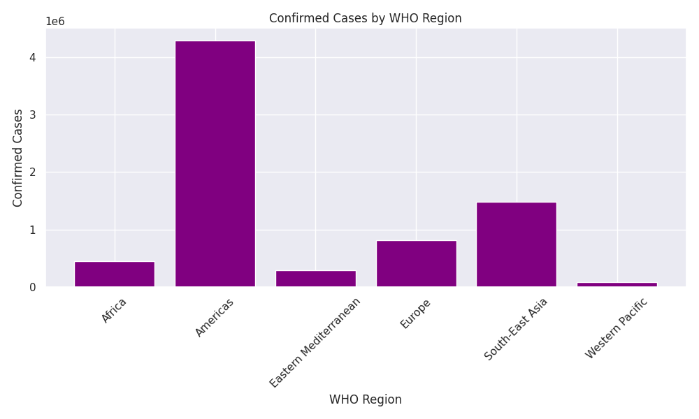
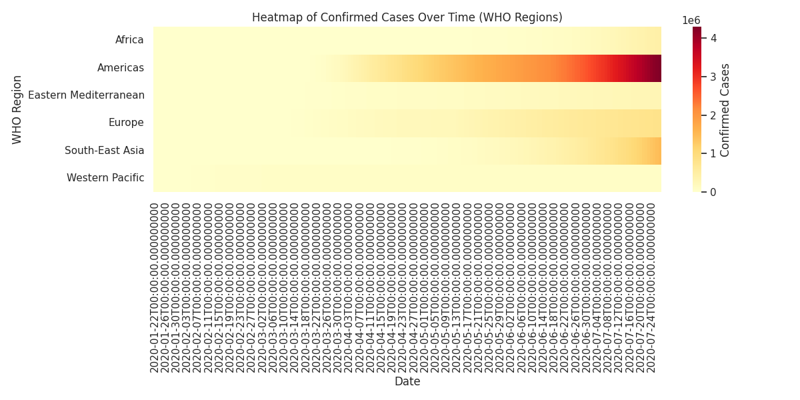

## Project Overview
This project analyzes global COVID-19 data to derive insights and trends, with a specific focus on India. The project uses Python libraries like Pandas, Matplotlib, and Seaborn for data processing, analysis, and visualizations.

## Key Features
- **Global Analysis**: Total cases, death rates, and recovery rates.
- **Top Affected Countries**: Bar chart of the top 10 countries by confirmed cases.
- **India-Specific Trends**: Time-series visualization of confirmed, deaths, recovered, and active cases.
- **WHO Region Analysis**: Comparison of confirmed cases across WHO regions.
- **Heatmap**: Heatmap visualization of confirmed cases over time by WHO region.

## Dataset
The dataset used is `covid_19_clean_complete.csv`, which includes columns like:
- `Country/Region`, `Date`, `Confirmed`, `Deaths`, `Recovered`, `Active`, `WHO Region`.

## Visualizations
The following visualizations are generated:
- **Top 10 Countries** by confirmed cases.
- **India COVID-19 Trends** over time.
- **WHO Region Comparison** of confirmed cases.
- **Heatmap** of confirmed cases.

## Setup Instructions
1. Clone this repository.
2. Install the required libraries:
   ```bash
   pip install -r requirements.txt
   ```
3. Run the analysis, results will be saved in the `images/` folder.

## Technologies Used
- **Python**: Data analysis and scripting.
- **Pandas**: Data cleaning and preprocessing.
- **Matplotlib & Seaborn**: Data visualization.

## Results




